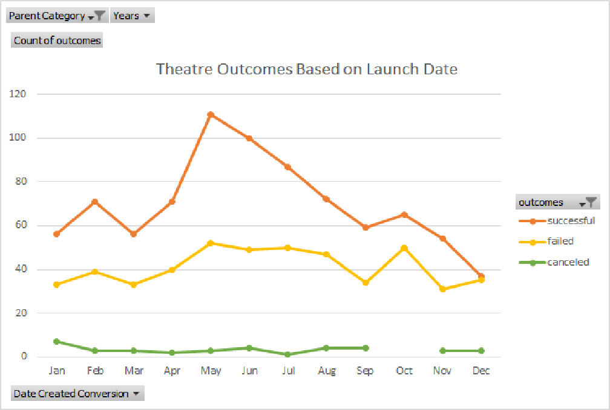
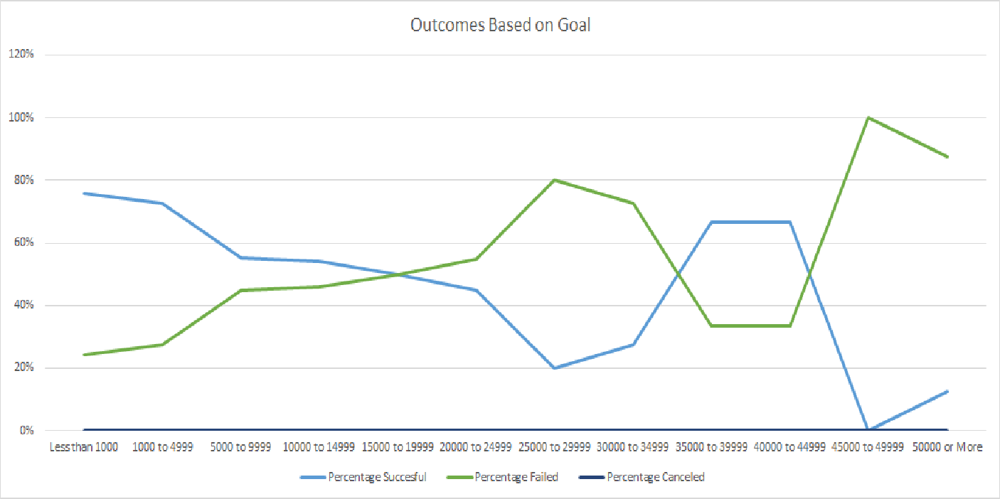

# Kickstarting with Excel
## Overview of Project
Kickstarter project data is analyzed to reveal trends within campaign strategies. Theatre campaign information is brought about by organizing and filtering the many subcategories into one specific category of, "plays". What was once a broad dataset, narrows down to a more concise and manageable dataset. Two main strategic factors come into focus: Outcomes Based on Goals and Theatre Outcomes Based on Launch Date. 
### Purpose
The purpose of this project is to aid the client, Louise, on her trek towards initiating a Kickstarter campaign for her play, "Fever". Louise estimates a $10,000 budget. Therefore, my goal is to usilize the given Kickstarter data and zero in on strategies to enhance her crowdfunding and play success. 
## Analysis and Challenges
### Outcomes Based on Launch Date Analysis
Within Kickstarter, the first obstacle was to tackle the multitude of unnecessary data we did not need. This resulted in making new columns titled Parent Categories and Subcategories. Using these two new, sorted, filtered, organized categories; pivot tables were then constructed. As requested by Louise, a visualize of how the different campaigns fared in relation to their launch date was created. 
The first pivot table consisted of sorting the Kickstarter data into three outcomes, "successful", "failed", and "canceled". I then filtered "Theatre" and "Years" derived from the Parent Category. This table can be located on the sheet named, "Theatre Outcomes Based on Launch Date".
Once the pivot table was created, I chose a line graph to best depict the results Louise was requesting. The graph shows that the most successful launch dates trend upward in the months of May and June. Therefore, summer months are the best time of the year for launching. In addition, a higher number of campaigns launched in these two months shows a massive gap between "failed" and "successful".

### Outcomes Based on Launch Date Analysis
To achieve this pivot table, I first had to utilize the =countifs() function. This funtion gives way to examining how campaigns either sank or swam given their alotted funding goals by monetary values. By separating the funds into twelve different ranges, i.e., <$1000, $1000-$4999, $5000-$9999, etc.
By toggling with the filters I was able to solely show the outcomes for the subcategory, "plays". This brought about a happy result, zero cancelations regarding plays through Kickstarter campaigns! 
After turning the toatals of the "Successful", "Failed", and "Canceled", plays into percentages, I was then able to compare them against their respective funding goals. The graph eximplifies the outcomes by their percentage of total campaigns for each funding amount range. The line graph is an odd picture. There is no discerning data except for the wide gap towards the end of the $45000-$49999 range. 

## Challenges and Difficulties
- The biggest challenge was definitely brouguht to light when =countifs() came into play. I found formulating the correct wording and symbols in the proper format to be time consuming and tedious. I then asked classmates and a TA for assistance which resulted in the correct outcomes. 
# Results
## Theatre Outcomes Based on Launch Date Conclusions
- By looking at the graph, it is obvious that the best time to launch a play is in the summer months, particularly May and June. 
- On the contrary, the worst time to launch a play is winter months, specifically December.
## Outcomes Based on Goals Conclusions
- When looking at this graph, I see the that the more attainable, modest range goals were the most successful. As the range goals amount increase the success of the plays takes a sudden dive into failure. This concludes that realistic goals result in sucessful outcomes.
## Limitations
- While this data set includes varied quantifiable information, there are some details that could be added to narrow in on a more successful strategy for Louise to achieve. For example, what are the genres of plays? Age range of the audience? Small town vs big metro? What type of advertising is being done? Cost of advertising? Indoor or outdoor plays? Concession stand? All of these small but different factors all correlate to the end result being scewed. 
## Additional Tables, Graphs, Charts that Could be Useful
- Possibly graphing average donations against backers and time of campaign goals to be met. This would identify how long a goal could take to be reached, how many backers are supporting as well as donating in the allotted time. 
